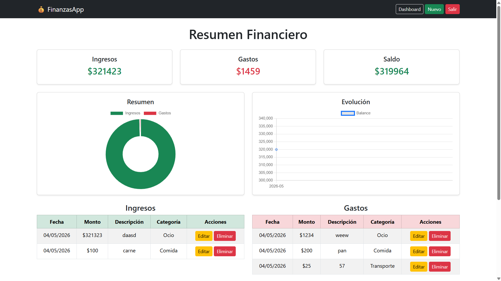
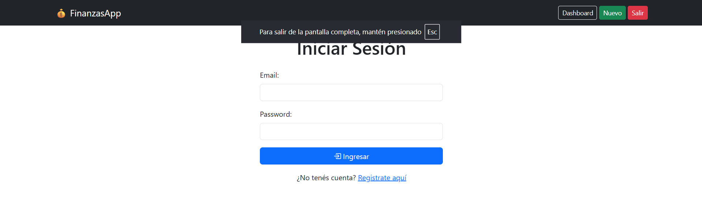

# 💰 AppFinanzas

Aplicación web desarrollada con Flask para gestionar ingresos y gastos personales de manera simple, visual y segura.

---

# 🚀 Demo Online

👉 https://appfinanzas.onrender.com

(Reemplazá este link por el tuyo real de Render)

---

# ✨ Características

✅ Registro de usuarios  
✅ Inicio y cierre de sesión  
✅ Autenticación segura con Flask-Login  
✅ Contraseñas protegidas con Bcrypt  
✅ Dashboard financiero interactivo  
✅ Registro de ingresos y gastos  
✅ Edición y eliminación de movimientos  
✅ Categorías personalizadas  
✅ Balance automático  
✅ Gráficos dinámicos con Chart.js  
✅ Diseño responsive con Bootstrap 5  
✅ Base de datos SQLite  

---

# 📸 Capturas

## Dashboard



## Login



---

# 🛠️ Tecnologías utilizadas

- Python
- Flask
- Flask-Login
- Flask-Bcrypt
- Flask-SQLAlchemy
- Bootstrap 5
- Chart.js
- SQLite
- HTML5
- CSS3

---

# 📂 Estructura del proyecto

```bash
APPFINANZAS/
│
├── app/
│   ├── templates/
│   │   ├── base.html
│   │   ├── dashboard.html
│   │   ├── formulario.html
│   │   ├── editar.html
│   │   ├── login.html
│   │   ├── registro.html
│   │   └── inicio.html
│   │
│   ├── __init__.py
│   ├── models.py
│   └── routes.py
│
├── static/
│   └── style.css
    └─ img
│
├── instance/
│   └── finanzas.db
│
├── run.py
├── requirements.txt
└── README.md